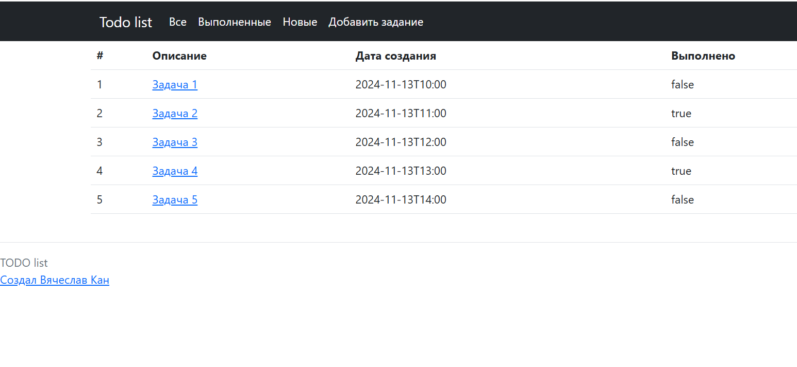
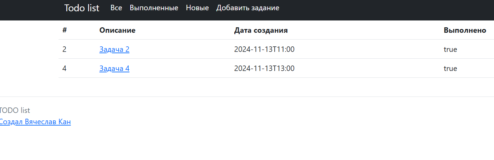
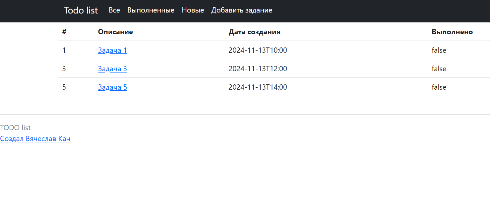
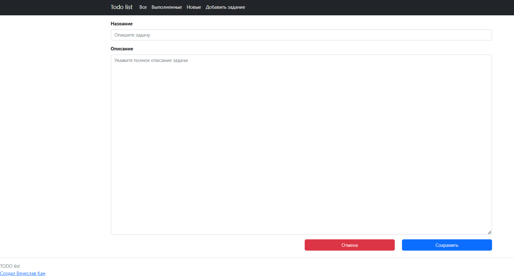

# job4j_todo

## О проекте

#### Приложение "TODO List".

- Проект демонстрирует работу приложения "Планировщик задач" и включает в себя следующие возможности:
    - Добавление новой задачи
    - Редактирование существующей задачи
    - Изменение статуса задачи на "Выполнено"
    - Удаление задачи

- Список использованных технологий:
    - Java 17
    - Spring boot
    - Thymeleaf
    - Bootstrap
    - Hibernate 5.6.11.Final
    - PostgreSql 42.2.9
        
#### Главная страница / все задачи

### Выполненные задачи

### Новые задачи

### Создание новой задачи

