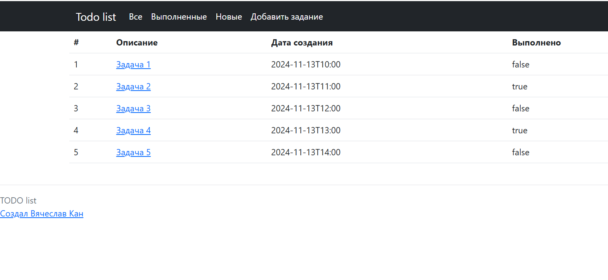
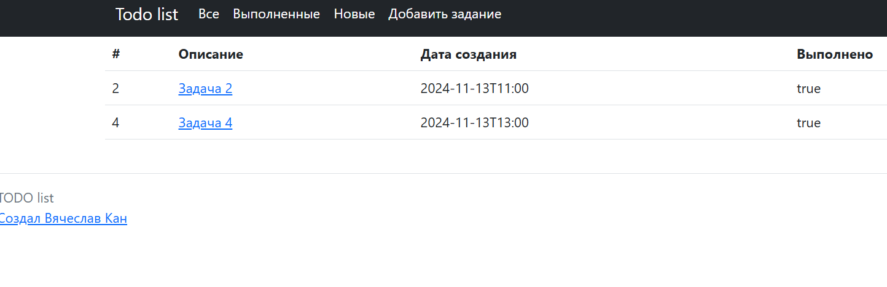
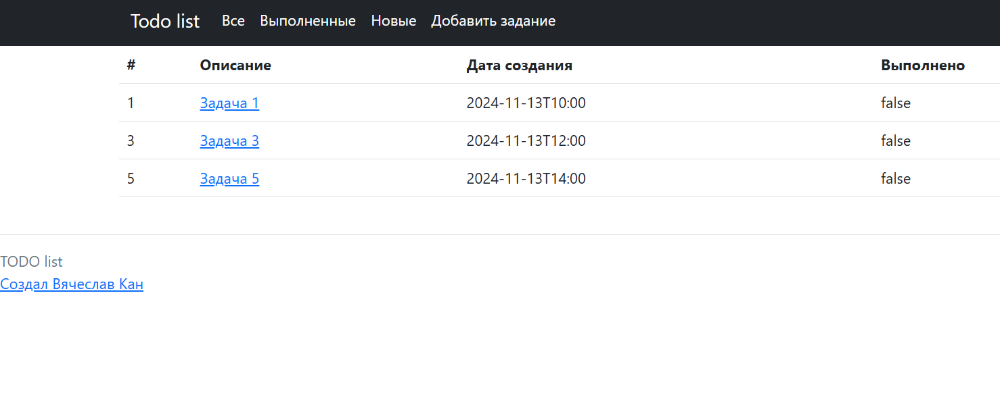
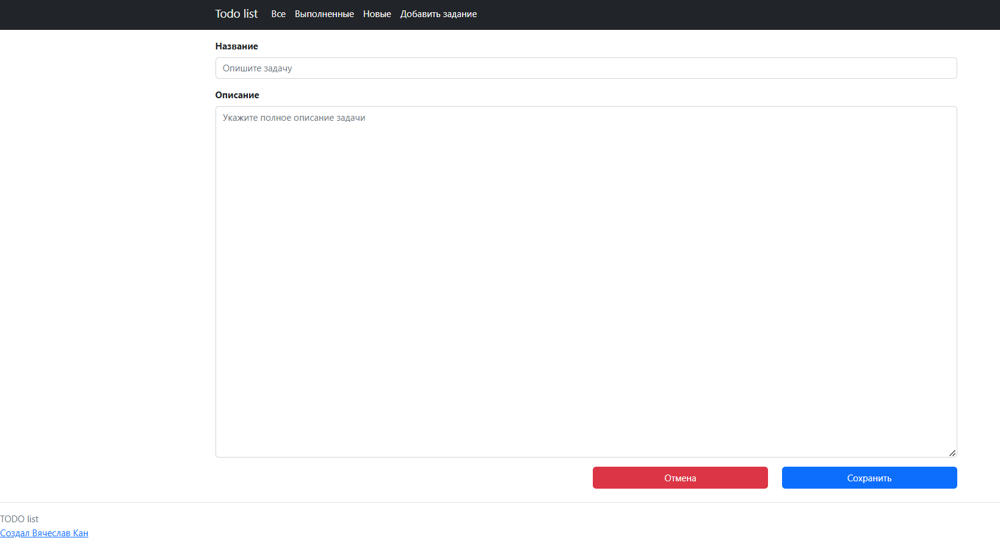

# job4j_todo

## О проекте

#### Приложение "TODO List".

- Проект демонстрирует работу приложения "Планировщик задач" и включает в себя следующие возможности:
    - Добавление новой задачи
    - Редактирование существующей задачи
    - Изменение статуса задачи на "Выполнено"
    - Удаление задачи

- Список использованных технологий:
    - Java 17
    - Spring boot
    - Thymeleaf
    - Bootstrap
    - Hibernate 5.6.11.Final
    - PostgreSql 42.2.9

#### Запуск проекта

- Необходимо открыть класс src/main/java/ru/job4j/todo/Job4jTodoApplication.java и запустить метод main().
    - Для отправки запросов на сервер необходимо:
      1. Выполнить процедуру регистрации пользователя и входа в систему:
          1.1 пройти по ссылке http://localhost:8080/users/register и выполнить
          регистрацию пользователя
          1.2 Для входа в систему необъходимо по ссылке http://localhost:8080/users/login выполнить вход, далее будет
          выполнено перенаправление на страницу с отображением всех задач.
    - либо
      2. Выполнить вход по следующим данным: логин - "user@mail.ru", пароль - "111", далее будет
      выполнено перенаправление на страницу с отображением всех задач.

#### Главная страница / все задачи

### Выполненные задачи

### Новые задачи

### Создание новой задачи

